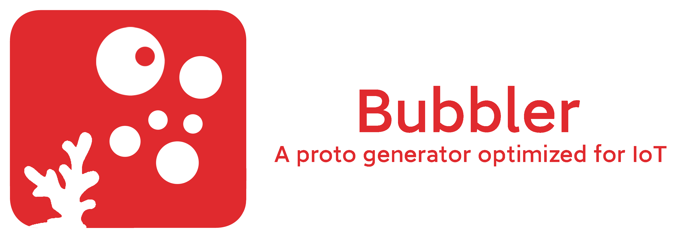

# Bubbler

English | [简体中文](README_cn.md)

Bubbler is a proto generator optimized for IoT devices. It compiles the `.bb` proto file and generates the output in the specified target language.

Bubbler's proto is powerful and can be non-byte-aligned, which is useful for IoT devices with limited resources. Explained below.

Also, you may need syntax highlighting for `.bb` files, see [bubbler-vscode](https://github.com/xaxys/bubbler-vscode), or install it from [VSCode Marketplace](https://marketplace.visualstudio.com/items?itemName=xaxys.Bubbler).

Warning: Bubbler is still in development and is not ready for production use.

## Installation

You can download the latest release and the precompiled binary from the [releases page](https://github.com/xaxys/bubbler/releases/).

Or you can build from source code:

```sh
git clone https://github.com/xaxys/bubbler.git
cd bubbler
make
```

## Usage

```sh
bubbler [options] <input file>
```

### Options

- `-t <target>`: Target language
- `-o <output>`: Output Path
- `-rmpath <path[,path...]>`: Remove Path Prefix (Remove the path prefix of the output file path when generating files)
  This option is usually used when generating Go target. For example, if a `.bb` file has `go_package` option set to `github.com/xaxys/bubbler/proto/rpc`, the generated file will be generated in the `output/github.com/xaxys/bubbler/proto/rpc` directory. If you want to remove the path prefix `github.com/xaxys/bubbler/proto/rpc`, you can set this option to `github.com/xaxys/bubbler/proto`. Then the generated file will be generated in the `output/rpc` directory.
- `-relpath`: Generate Relative Path Imports (Use relative paths like `../` and `./` when a generated file imports another generated file, instead of relying on the configured main package structure or absolute path logic).
- `-inner`: Generate Inner Class (Nested Struct)
- `-single`: Generate Single File (Combine all definitions into one file, instead of one generated file per source file)
- `-minimal`: Generate Minimal Code (Usually without default getter/setter methods)
- `-decnum`: Force Generate Decimal Format for Constant Value (Translate `0xFF` to `255`, `0b1111` to `15`, etc.)
- `-memcpy`: Enable memory copy for fields (Duplicate content of `string` and `bytes` fields when decoding, instead of directly referencing the original buffer)
- `-signext <method>`: Sign Extension Method used for Integer Field (Options: `shift`, `arith`)
- `-compat`: Generate Compatible Code (Use `Array` instead of typed arrays like `Uint8Array` for buffers and `bytes` fields in CommonJS target. By default, `Uint8Array` is used for better performance.)
- `-unroll <threshold>`: Loop Unroll Threshold for Array Codec (Default: `4`). When an array length exceeds this threshold, the generated `encode`/`decode` and `encode_size`/`decode_size` code will use loops. Set to `-1` to always unroll arrays regardless of size. For example, `-unroll=1` will use loops for all arrays with more than 1 element, while `-unroll=8` will only use loops for arrays with more than 8 elements.

### Examples

```sh
bubbler -t c -minimal -o output/ example.bb
bubbler -t c -single -o gen.hpp example.bb
bubbler -t py -decnum -signext=arith -o output example.bb
bubbler -t go -rmpath github.com/xaxys/bubbler/proto -o output example.bb
```

### Target Languages

Run `bubbler` to see the list of supported target languages.

```text
Targets:
  c
  cpp
  csharp [cs]
  commonjs [cjs]
  esmodule [javascript, js, mjs, esm]
  go
  java
  python [py]

```

When selecting the target language, you can use the aliases inside `[]`. For example, `python` can be abbreviated as `py`.

- `c`: C language, output one `.bb.h` file and one `.bb.c` file for each `.bb` file.
  - With `-single`: Output one file that includes all definitions for all `.bb` files. The output file name (including the extension) is determined by the `-o` option.
  - With `-minimal`: No generation of getter/setter methods for fields.
  - With `-memcpy`: Use `malloc` to heap-allocate memory for `string` and `bytes` fields, and copy the content from the original buffer.
  - Without `-memcpy`: Pointer reference to the original buffer for `string` and `bytes` fields. Zero-copy and zero-heap-allocate.
  
    **Warning**: Decoding function generated without `-memcpy` will still accept `const void*` as input, but this CONST may be VIOLATED, since the decoded struct will reference the original buffer for some fields. You MUST ensure that the original buffer remains VALID and UNCHANGED, and changing the value from the struct will also CHANGE the content in the buffer.
  - With `-relpath`: Generate relative path imports (e.g. `#include "./foo_bb.h"` or `#include "../foo_bb.h"`).

- `cpp`: C++ language, output one `.bb.hpp` file and one `.bb.cpp` file for each `.bb` file. The folder structure will not be affected by the `cpp_namespace` option.
  - With `-single`: Output one file that includes all definitions for all `.bb` files. The output file name (including the extension) is determined by the `-o` option.
  - With `-minimal`: No generation of getter/setter methods for fields.
  - With `-memcpy`: Use `std::shared_ptr<uint8_t[]>` to heap-allocate memory for `bytes` fields, and copy the content from the original buffer. `string` fields will always use `std::string` and be copied every time.
  - Without `-memcpy`: Use `std::shared_ptr<uint8_t[]>` with null deleter to reference the original buffer for `bytes` fields. `string` fields will always use `std::string` and be copied every time. Zero-copy and zero-heap-allocate.

    **Warning**: Decoding function generated without `-memcpy` will still accept `const void*` as input, but this CONST may be VIOLATED, since the decoded struct will reference the original buffer for some fields. You MUST ensure that the original buffer remains VALID and UNCHANGED, and changing the value from the struct will also CHANGE the content in the buffer.
  - With `-relpath`: Generate relative path imports (e.g. `#include "./foo_bb.hpp"` or `#include "../foo_bb.hpp"`).

- `csharp`: C# language, output one `.cs` file for each structure defined in each `.bb` file. The folder structure will not be affected by the `csharp_namespace` option.
  - With `-single`: Output one file that includes all definitions for all `.bb` files. The output file name (including the extension) is determined by the `-o` option.
  - With `-memcpy`: Use `byte[]` as the type for `bytes` fields. Encode and decode methods will only be compatible with `byte[]` parameters. Older .NET Framework versions should use this option.
  - Without `-memcpy`: Use `Memory<byte>` as the type for `bytes` fields. Encode and decode methods will be compatible with `byte[]`, `Memory<byte>` and `Span<byte>` (encode only) parameters. The `System.Memory` package is required for this case.

- `commonjs`: CommonJS module, output one `.bb.js` file for each `.bb` file. (Please note that `BigInt` is used for `int64` and `uint64` fields, which is not supported in some environments.)
  - With `-single`: Output one file that includes all definitions for all `.bb` files. The output file name (including the extension) is determined by the `-o` option.
  - Without `-compat`: Use `Uint8Array` for encode buffers and `bytes` fields for better performance (default).
  - With `-compat`: Use `Array` instead of `Uint8Array` for encode buffers and `bytes` fields, maximizing compatibility with older environments.
  - Force enabled: `-memcpy`.
  - Force enabled: Relative paths are always used via `require()`. `-relpath` is implicitly enabled.

- `esmodule`: ES6 module, output one `.bb.js` file for each `.bb` file. Uses native `import`/`export` syntax, suitable for modern browsers and Node.js ESM. (Please note that `BigInt` is used for `int64` and `uint64` fields, which is not supported in some environments.)
  - With `-single`: Output one file that includes all definitions for all `.bb` files. The output file name (including the extension) is determined by the `-o` option.
  - Without `-compat`: Use `Uint8Array` for encode buffers and `bytes` fields for better performance (default).
  - With `-compat`: Use `Array` instead of `Uint8Array` for encode buffers and `bytes` fields, maximizing compatibility with older environments.
  - Force enabled: `-memcpy`.
  - Force enabled: Relative paths are always used via `import`. `-relpath` is implicitly enabled.

- `go`: Go language, output one `.bb.go` file for each `.bb` file. The folder structure will be affected by the `go_package` option. (i.e., `github.com/xaxys/bubbler` will generate in the `github.com/xaxys/bubbler` directory)
  - With `-single`: Output one file that includes all definitions for all `.bb` files. The output file name (including the extension) is determined by the `-o` option. The package name is determined by the package statement of the input `.bb` file.
  - With `-memcpy`: Make a copy of the `bytes` field when decoding. The `string` field will always be copied.
  - Without `-memcpy`: A slice of the original buffer will be assigned to the `bytes` field. The `string` field will always be copied.
  - With `-relpath`: Generate relative path imports (e.g. `import "./foo_bb"` or `import "../subpkg/foo_bb"`). If `go_package` is set, the generated relative path will be calculated based on the package path defined by `go_package`.
  **Notice!** The `-rmpath` option is NOT considered when calculating relative paths between modules for Go. That is, if the package path of A is `github.com/xaxys/a`, the package path of B is `gitlab.com/user/b`, and `-rmpath=github.com/xaxys` is set, then the output path of A will be `a`, the output path of B will be `gitlab.com/user/b`, but the imported path of A inside B will still be calculated as `../../github.com/xaxys/a`, instead of `../../a`.

- `java`: Java language, output one `.java` file for each structure defined in each `.bb` file. The folder structure will be affected by the `java_package` option. (i.e., `com.example.rovlink` will generate in the `com/example/rovlink` directory)
  - Force enabled: `-memcpy`.

- `python`: Python language, output one `_bb.py` file for each `.bb` file.
  - With `-single`: Output one file that includes all definitions for all `.bb` files. The output file name (including the extension) is determined by the `-o` option.
  - Force enabled: `-memcpy`.
  - With `-relpath`: Generate relative path imports (e.g. `from .foo_bb import *` or `from ..foo_bb import *`).

## Protocol Syntax

Bubbler uses a concise syntax to define data structures and enumeration types.

See examples in the [example](example/) directory.

### Package Statements

Use the `package` keyword to define the package name. For example:

```protobuf
package com.example.rovlink;
```

The package name is used to generate the output file name. For example, if the package name is `com.example.rovlink`, the output file name is `rovlink.xxx` and is placed in the `${Output Path}/com/example/` directory.

Only one package statement is allowed in a `.bb` file, and it can not be duplicated globally.

### Option Statements

Use the `option` keyword to define options. For example:

```protobuf
option omit_empty = true;
option go_package = "example.com/rovlink";
option cpp_namespace = "com::example::rovlink";
option csharp_namespace = "Example.Rovlink";
option java_package = "com.example.rovlink";
```

The option statement cannot be duplicated in a `.bb` file.

Warning will be reported if an option is unknown.

#### Supported Options

##### `omit_empty`

If `omit_empty` is set to `true`, the generated code will not generate files without typedefs.

```protobuf
package all;

option omit_empty = true;

import "rovlink.bb";
import "control.bb";
import "excomponent.bb";
import "excontrol.bb";
import "exdata.bb";
import "host.bb";
import "mode.bb";
import "sensor.bb";
```

In this example, the `omit_empty` option is set to `true`, and this `.bb` file will not generate an `all.xxx` file.

You can use this option to generate multiple `.bb` files at once, without writing an external script to do multiple `bubbler` calls.

##### `go_package`

If `go_package` is set, the generated code will use the specified package name in the generated Go code. The generated folder structure will be based on the package name.

##### `cpp_namespace`

If `cpp_namespace` is set, the generated code will use the specified namespace in the generated C++ code. The generated folder structure will not be affected.

##### `csharp_namespace`

If `csharp_namespace` is set, the generated code will use the specified namespace in the generated C# code. The generated folder structure will not be affected.

##### `java_package`

If `java_package` is set, the generated code will use the specified package name in the generated Java code. The generated folder structure will be based on the package name.

### Import Statements

Use the `import` keyword to import other Bubbler protocol files. For example:

```python
import "control.bb";
import "a.bb";
```

### Enumeration Types

Use the `enum` keyword to define enumeration types. The definition of an enumeration type includes the enumeration name and enumeration values. For example:

```c
enum FrameType[1] {
    SENSOR_PRESS = 0x00,
    SENSOR_HUMID = 0x01,
    CURRENT_SERVO_A = 0xA0,
    CURRENT_SERVO_B = 0xA1,
};
```

### Variable-sized Types

Bubbler supports `string` and `bytes` types for variable-sized data.

#### String

`string` type is used for text strings. In binary form, the text encoding of a string field is UTF-8. Since a string shouldn't contain any EOF character, the end of a string is defined by `\0` in data stream. So the size of a string field is `str.utf8_length + 1`.

**Warning**: UTF-8 encoding is a convention. In C and C++ target, UTF-8 encoding is NOT handled by the generated code. It is user's responsibility to ENSURE that the string value is UTF-8 encoded. But in other modern languages such as Go, Java, Python, JS, UTF-8 encoding is handled by the generated code. (But if you are only using C/C++, you can ignore the convention and use any encoding you want, as long as the end of the string is denoted by `\0`.)

#### Bytes

`bytes` type is used for store binary data in any form. In binary form, bytes data is store in `length` + `data` two part.

`length` part denotes the num of bytes contained in the bytes field. It is composed by several size unit, each unit occupied 1 byte as below:

```text
  0   1   2   3   4   5   6   7
+---+---+---+---+---+---+---+---+
| C |       7-bit Size          |
+---+---+---+---+---+---+---+---+
  C = Continue Flag
```

Continue Flag indicates if there is another size unit after this unit. If Continue Flag is 0, it is the last size unit.

7-bit spaces stores the length in little-endian.

Therefore, 1 size unit can represent 0-127 bytes data; 2 size units can represent 128-16383 bytes data; ...

`data` part contains the raw binary data in continues form.

**Note**: Variable-sized types make the structure size dynamic.

### Enum Value as Constant

You can use enum values defined in previous enum types as constant values for fields or other enum values.

```protobuf
enum FrameType[1] {
    FRAME_DATA = 0x01,
};

struct DataFrame {
    FrameType opcode = FRAME_DATA;
    bytes data;
};
```

In this example, `FrameType` is an enumeration type with four enumeration values: `SENSOR_PRESS`, `SENSOR_HUMID`, `CURRENT_SERVO_A`, and `CURRENT_SERVO_B`.

Enumeration values cannot be negative (tentatively), and if the value is not filled in, the default value of the enumeration value is the previous enumeration value plus 1.

The number in the square brackets after the enumeration type name indicates the width of the enumeration type, for example, `[1]` indicates 1 byte. You can also use the `#` symbol to represent bytes and bits, for example, `#1` represents 1 bit, `#2` represents 2 bits. You can also use them in combination, for example, `1#4` represents 1 byte 4 bits, that is, 12 bits.

Recommended to use **PascalCase** for enumeration type names. But only capitialization of the first letter is mandatory.

Recommended to use **ALLCAP_CASE** for enumeration values. But only capitialization of the first letter is mandatory.

### Data Structures

Use the `struct` keyword to define data structures. The definition of a data structure includes the structure name and a series of fields. For example:

```c
struct Frame[20] {
    FrameType opcode;
    struct SomeEmbed[1] {
        bool valid[#1];
        bool error[#1];
        uint8 source[#3];
        uint8 target[#3];
    };
    uint8<18> payload;
};
```

In this example, `Frame` is a data structure with three fields: `opcode`, `SomeEmbed`, and `payload`. `opcode` is of type `FrameType`, `SomeEmbed` is an anonymous embedded data structure, and `payload` is of type `uint8`.

Please note that Bubbler does not have the concept of scope (to accommodate the C language), so the names `Frame` and `SomeEmbed` as data structure names are not allowed to be duplicated globally, even if `SomeEmbed` is an anonymous embedded data structure.

This also defines the structure width to be 20 bytes. The structure width is optional and can be written as `struct Frame {` without the width.

If the width is not filled in, the structure width is the sum of all field widths. However, if the width is filled in, the structure width must be exactly equal to the sum of all field widths, otherwise an error will occur. If the structure contains variable-sized fields (such as `string` or `bytes`), or other variable-sized structures, the structure width must be omitted.

Recommended to use **PascalCase** for data structure names. But only capitialization of the first letter is mandatory.

Recommended to use **snake_case** for field names. But only uncaptialization of the first letter is mandatory.

### Field Types

The Bubbler protocol supports four types of fields: regular fields, anonymous embedded fields, constant fields, and empty fields.

- Regular fields: Consist of a type name, field name, and field width (optional).
- Anonymous embedded fields: An anonymous field, which can be a struct definition or a defined struct name, its internal subfields will be promoted and expanded into the parent structure.
- Constant fields: A field with a fixed value, its value is determined at the time of definition and cannot be modified. The field name is optional. If there is a field name, the corresponding field will be generated. When encoding, the value of the constant field will be ignored. When decoding, the value of the constant field will be checked. If it does not match, an error will be reported.
- Empty fields: A field without a name and type, only width, used for placeholders.

#### Regular Fields

Regular fields consist of a type name, field name, and field width. For example:

```c
struct Frame {
    RovlinkFrameType opcode;
};
```

In this example, `opcode` is a regular field, its type is `RovlinkFrameType`.

The field width is optional. If the width is not filled in, the field width is the width of the type.

The field width can be less than the width of the type, for example:

```c
struct Frame[20] {
    int64 my_int48[6];
};
```

In this example, `my_int48` is a 6-byte field, its type is `int64`, but its width is 6 bytes, so it will only occupy 6 bytes of space when encoding.

However, for fields of `struct` type, the field width must be equal to the width of the type

### Anonymous Embedded Fields

Anonymous embedded fields are nameless data structures that can contain multiple subfields. For example:

```c
struct Frame {
    int64 my_int48[6];
    struct SomeEmbed[1] {
        bool valid[#1];
        bool error[#1];
        uint8 source[#3];
        uint8 target[#3];
    };
};
```

In this example, `SomeEmbed` is an anonymous embedded field, it contains four subfields: `valid`, `error`, `source`, and `target`.

The subfields of the anonymous embedded field will be promoted and expanded into the parent structure. The generated structure is as follows:

```c
struct Frame {
    int64_t my_int48;
    bool valid;
    bool error;
    uint8_t source;
    uint8_t target;
};
```

Anonymous embedded fields can also be a defined data structure, for example:

```c
struct AnotherTest {
    int8<2> arr;
}

struct Frame {
    int64 my_int48[6];
    AnotherTest;
    uint8<18> payload;
};
```

In this way, the generated structure is as follows:

```c
struct Frame {
    int64_t my_int48;
    int8_t arr[2];
    uint8_t payload;
};
```

### Constant Fields

Constant fields are fields with a fixed value, its value is determined at the time of definition and cannot be modified. For example:

```c
struct Frame {
    uint8 FRAME_HEADER = 0xAA;
};
```

In this example, `FRAME_HEADER` is a constant field with a value of `0xAA`.

Or you can use an enum value defined in a previous enum type as a constant value:

```c
enum FrameType[1] {
    FRAME_KEEPALIVE = 0x00,
    FRAME_DATA = 0x01,
};

struct Frame {
    FrameType opcode = FRAME_DATA;
    bytes data;
};
```

The value of the constant field will be ignored during encoding and checked during decoding. If it does not match, an error will be reported.

### Empty Fields

Empty fields are fields without a name and type, they only have a width. Empty fields are often used for padding or aligning data structures. For example:

```c
struct Frame {
    void [#2];
};
```

In this example, `void [#2]` is an empty field that occupies 2 bits of space.

### Field Options

Field options are used to specify additional attributes of a field. For example, you can use the `order` option to specify the byte order of an array:

```c
struct AnotherTest {
    int8<2> arr [order = "big"];
}
```

In this example, the byte order of the `arr` field is set to big-endian.

> Note: The setting of endianness is also effective for floating-point types. However, currently, floating-point values are always interpreted in little-endian order, with the most significant bit storing the sign bit, followed by the exponent bits, and finally the fraction bits.
>
> What does this mean? For example, for a `uint32` field with value `0x00123456`, you can set its field width to 3 bytes, making it a `"uint24"`. You can then encode this `"uint24"` in big-endian as `12 34 56`, or in little-endian as `56 34 12`.
>
> However, for a `float32` field with sign bit `1`, if you set its field width to 31 bits, the sign bit is discarded during encoding. It thus becomes an `"unsigned float31"`. Although you can still choose big-endian or little-endian encoding, the sign bit is always discarded regardless of the encoding, so when decoded its sign bit will always be `0`.

### Custom getter/setter

You can define custom getter and setter methods for a field to perform specific operations when reading or writing field values. For example:

```c
struct SensorTemperatureData {
    uint16 temperature[2] {
        get temperature_display(float64): value / 10 - 40;
        set temperature_display(float64): value == 0 ? 0 : (value + 40) * 10;
        set another_custom_setter(uint8): value == 0 ? 0 : (value + 40) * 10;
    };
}
```

In this example, the `temperature` field has a custom getter method and two custom setter methods.

The custom getter named `temperature_display` returns a`float64` type and calculates the result based on `value / 10 - 40`. Here,`value` is filled with the field value and is of type `uint16`.

The custom setter named `temperature_display` accepts a `float64` type parameter and calculates the result based on `value == 0 ? 0 : (value + 40) * 10` to set the field value. Here, `value` is filled with the parameter value and is of type `float64`.

The custom setter named `another_custom_setter` accepts a `uint8` type parameter and calculates the result based on `value == 0 ? 0 : (value + 40) * 10` to set the field value. Here, `value` is filled with the parameter value and is of type `uint8`.

Please note that the custom getter and setter method names cannot be the same as any field names, and getter and setter methods with the same name must return and accept the same type.

Recommended to use **snake_case** for getter/setter names. But only uncaptialization of the first letter is mandatory.

## Generated Code API

The generated code for each language provides a consistent API for encoding and decoding.

### C

```c
// Encode struct to buffer. Returns number of bytes written.
uint64_t <StructName>_encode(struct <StructName>* ptr, void* data);

// Decode struct from buffer. Returns number of bytes read, or -1 on error.
int64_t <StructName>_decode(const void* data, struct <StructName>* ptr);

// Estimate encoded size in bytes.
uint64_t <StructName>_encode_size(struct <StructName>* ptr);

// Returns the encoded size (> 0) if successful, 
// or the negative minimum required size (< 0) if data is insufficient.
// The required size may change as more data is provided.
int64_t <StructName>_decode_size(const void* data, uint64_t size);
```

### C++

```cpp
// Encode to buffer. Returns number of bytes written.
// Without -compat (C++20):
uint64_t encode(::std::span<uint8_t> buf) const;
// Without -compat: compatibility proxy (deprecated)
[[deprecated("Use encode(::std::span<uint8_t>) instead")]]
uint64_t encode(void* data) const;
// With -compat:
uint64_t encode(void* data) const;

// Decode from buffer. Returns number of bytes read, or -1 on error.
// Without -compat (C++20):
int64_t decode(::std::span<const uint8_t> data);
// Without -compat: compatibility proxy (deprecated)
[[deprecated("Use decode(::std::span<const uint8_t>) instead")]]
int64_t decode(const void* data);
// With -compat:
int64_t decode(const void* data);

// Estimate encoded size in bytes.
uint64_t encode_size() const;

// Returns the encoded size (> 0) if successful, 
// or the negative minimum required size (< 0) if data is insufficient.
// The required size may change as more data is provided.
// Without -compat (C++20):
static int64_t decode_size(::std::span<const uint8_t> buf);
// Without -compat: compatibility proxy (deprecated)
[[deprecated("Use decode_size(::std::span<const uint8_t>) instead")]]
static int64_t decode_size(const void* data, uint64_t size);
// With -compat:
static int64_t decode_size(const void* data, uint64_t size);
```

### Go

```go
// Encode. Returns encoded bytes.
func (s StructName) Encode() []byte

// Encode to buffer. Returns number of bytes written.
func (s StructName) EncodeTo(data []byte) int

// Decode from buffer. Returns number of bytes read, or -1 on error.
func (s *StructName) Decode(data []byte) int

// Estimate encoded size in bytes.
func (s StructName) EncodeSize() int

// Returns the encoded size (> 0) if successful,
// or the negative minimum required size (< 0) if data is insufficient.
// The required size may change as more data is provided.
func (s *StructName) DecodeSize(data []byte) int
```

### Java

```java
// Encode to a newly allocated byte array.
public byte[] encode();

// Encode to buffer. Returns number of bytes written.
public int encode(byte[] data, int start);

// Decode from buffer. Returns number of bytes read, or -1 on error.
public int decode(byte[] data);
public int decode(byte[] data, int start);

// Estimate encoded size in bytes.
public int encodeSize();

// Returns encoded size if successful, otherwise negative required size.
public int decodeSize(byte[] data);
public int decodeSize(byte[] data, int start);
```

### Python

```python
# Encode to newly allocated bytes, or encode to a provided buffer.
def encode(self, buffer: Union[None, bytearray, memoryview] = None) -> Union[bytearray, int]:

# Decode from buffer.
# Returns (True, bytes_read) on success, (False, -1) on failure.
def decode(self, data: Union[bytes, bytearray, memoryview]) -> Tuple[bool, int]:

# Estimate encoded size in bytes.
def encode_size(self) -> int:

# Returns encoded size if successful, otherwise negative required size.
def decode_size(self, data: Union[bytes, bytearray, memoryview]) -> int:
```

### C\#

```csharp
// Encode to newly allocated byte array.
public byte[] Encode();

// Encode to buffer. Returns number of bytes written.
public int Encode(byte[] data, int start);

// Extra overloads when -memcpy=false:
public int Encode(Memory<byte> data);
public int Encode(Span<byte> data);

// Decode from buffer. Returns number of bytes read, or -1 on error.
public int Decode(byte[] data);
public int Decode(byte[] data, int start);

// Extra overload when -memcpy=false:
public int Decode(Memory<byte> memoryData);

// Estimate encoded size in bytes.
public int EncodeSize();

// Returns encoded size if successful, otherwise negative required size.
public int DecodeSize(byte[] data);
public int DecodeSize(byte[] data, int start);

// Extra overload when -memcpy=false:
public int DecodeSize(Memory<byte> memoryData);
```

### CommonJS

```javascript
// Static helpers
StructName.encode(obj, buffer, start);
StructName.decode(obj, data, start);
StructName.encode_size(obj);
StructName.decode_size(data, start);

// Instance helpers
obj.encode(data, start);
obj.decode(data, start);
obj.encode_size();
obj.decode_size(data, start);
```

Runtime helper functions generated as needed:

```javascript
// common
isObj(item);
mergeDeep(target, ...sources);

// optional by feature usage in schema
createArray(length, init);
floatToUint32Bits(value);
uint32BitsToFloat(value);
doubleToUint64Bits(value);
uint64BitsToDouble(value);
stringToUTF8BytesCount(str);
stringToUTF8Bytes(str, data, start);
stringFromUTF8Bytes(data, start);
```

### ESModule

```javascript
// Static helpers
StructName.encode(obj, buffer, start);
StructName.decode(obj, data, start);
StructName.encode_size(obj);
StructName.decode_size(data, start);

// Instance helpers
obj.encode(data, start);
obj.decode(data, start);
obj.encode_size();
obj.decode_size(data, start);
```

Runtime helper functions generated as needed:

```javascript
createArray(length, init);
floatToUint32Bits(value);
uint32BitsToFloat(value);
doubleToUint64Bits(value);
uint64BitsToDouble(value);
stringToUTF8BytesCount(str);
stringToUTF8Bytes(str, data, start);
stringFromUTF8Bytes(data, start);
```

## Contributing

Contributions to Bubbler are welcome.

## License

MIT License

## Related Repositories

- [CoralReefPlayer](https://github.com/DawningW/CoralReefPlayer) - CoralReefPlayer, a low-latency streaming media player.
- [OpenFinNAV](https://github.com/redlightASl/OpenFinNAV) - FinNAV, a flight control firmware library for underwater robots (ROV/AUV).
